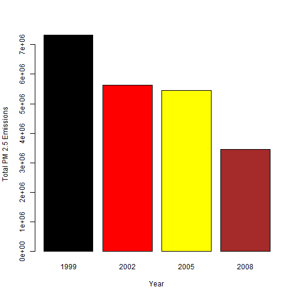
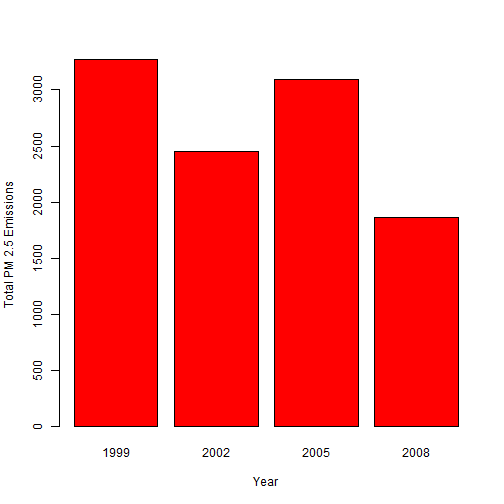
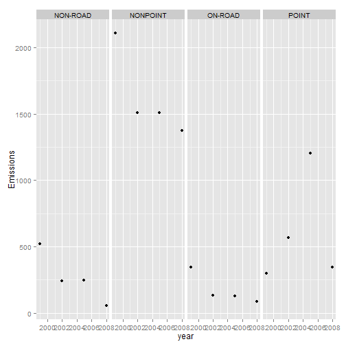
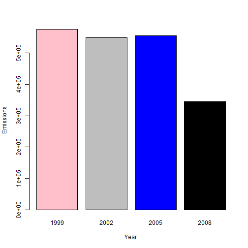
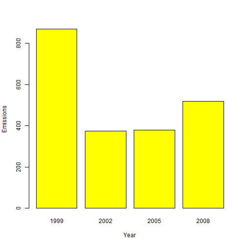
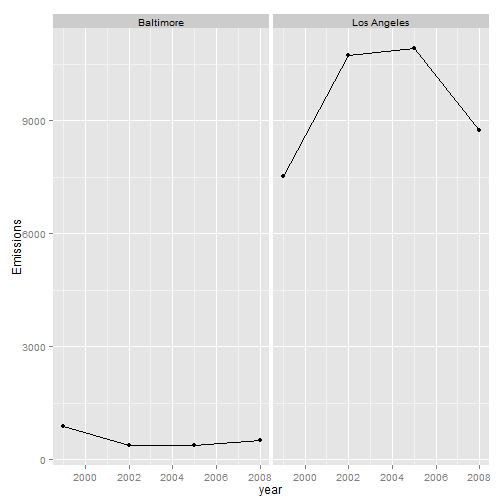

EDA Assignment 2  
Data source = Source_Classification_Code.rds & summarySCC_PM25.ds 
*Files are located int the root directory*

#### Load Data
This first line will likely take a few seconds. Be patient!


```r
library(ggplot2)
```

```
## Warning: package 'ggplot2' was built under R version 3.1.1
```

```r
NEI <- readRDS("summarySCC_PM25.rds")
SCC <- readRDS("Source_Classification_Code.rds")
```

---


####Question 1 :  
Plot a graph showing the total PM2.5 emission from all sources for each of  
the years 1999, 2002, 2005, and 2008.  
- tapply() is quite appropriate here to sum the data per year  
- a barplot seems more "visual " than a line graph ( I tested :-) )


```r
mysum <- tapply(NEI$Emissions, NEI$year, sum)
my_balt<- subset(NEI, fips=="24510")  # Baltimore Data
my_sum1 <- tapply(my_balt$Emissions, my_balt$year, sum)  # class array
my_tot<- aggregate (Emissions~type+year, data=my_balt,FUN="sum")  # class data frame
```


#### Plot1 


```r
barplot(mysum,col = c("black", "red", "yellow", "brown"), xlab = "Year", ylab = "Total PM 2.5 Emissions")
```

 

```r
dev.copy(png,file="plot1.png")
```

```
## png 
##   3
```

```r
dev.off()
```

```
## pdf 
##   2
```


---


####Question 2 :  
- Have total emissions from PM2.5 decreased in the Baltimore City?  
- Use the base plotting system to make a plot answering this question.


#### Plot2 


```r
barplot(my_sum1, col = c("Red", "Red", "Red", "Red"), xlab = "Year", ylab = "Total PM 2.5 Emissions")
```

 

```r
dev.copy(png,file="plot2.png")
```

```
## png 
##   3
```

```r
dev.off()
```

```
## pdf 
##   2
```

---

#### Question 3:
- Of the four types of sources indicated by the type (point,vnonpoint, onroad, nonroad) variable, which of these four sources have seen decreases in emissions from 1999-2008 for Baltimore City?  
- Which have seen increases in emissions from 1999-2008? 
- Use the ggplot2 


```r
qplot(year, Emissions, data=my_tot,facets=.~type,geom="point")
```

 

```r
dev.copy(png,file="plot3.png")
```

```
## png 
##   3
```

```r
dev.off()
```

```
## pdf 
##   2
```

Answer is **"Point"** type --

---

##### Question 4: 

1.  grep() will be used as we need to locate and grab specific data in fields  
2. A short str(SCC) helps identify which data and and hopw to exploit them  
3. From SCC =  the field SCC$Short.Name column has the combustion type info  
4, After extracteing the combustion data sets then subset for these SCCs from the NEI data set  
5. The which() funtion fits the purpose - (I could not get subset to work properly )


```r
my_coal<-SCC[grep("Comb.*Coal|Coal.*Comb",SCC$Short.Name),]  
my_nei<- NEI[which(NEI$SCC %in% my_coal$SCC),]
my_sum2 <- tapply(my_nei$Emissions, my_nei$year, sum)  # class array

# Plot 4

barplot(my_sum2,col = c("Pink", "Grey", "blue", "black"), xlab = "Year", ylab = "Emissions")
```

 

```r
dev.copy(png,file="plot4.png")
```

```
## png 
##   3
```

```r
dev.off()
```

```
## pdf 
##   2
```


#-------------------------------

#### Question 5.

There are Various ways to identify the data related to motor engines .
levels(SCC$EI.Sector) shows there are 59 levels with Levels 43 to 52 relating to motor engines.
[43] "Mobile - Aircraft"  
[44] "Mobile - Commercial Marine Vessels"  
[45] "Mobile - Locomotives"                              
[46] "Mobile - Non-Road Equipment - Diesel"              
[47] "Mobile - Non-Road Equipment - Gasoline"            
[48] "Mobile - Non-Road Equipment - Other"               
[49] "Mobile - On-Road Diesel Heavy Duty Vehicles"       
[50] "Mobile - On-Road Diesel Light Duty Vehicles"       
[51] "Mobile - On-Road Gasoline Heavy Duty Vehicles"     
[52] "Mobile - On-Road Gasoline Light Duty Vehicles"     
so we can exterxat the data using grep on the word "mobile"
afterwards same as above , extract the data from NEI


```r
my_engine_scc<-SCC[grep("Mobile",SCC$EI.Sector),]
my_engine_nei<- NEI[which(NEI$SCC %in% my_engine_scc$SCC),]

my_engine_balt<-my_engine_nei[my_engine_nei$fips=="24510",]
my_engine_sum <- tapply(my_engine_balt$Emissions, my_engine_balt$year, sum)  # class array

#Plot 5

barplot(my_engine_sum,  col = c("yellow", "yellow", "yellow", "yellow"), xlab = "Year", ylab = "Emissions")
```

 

```r
dev.copy(png,file="plot5.png")
```

```
## png 
##   3
```

```r
dev.off()
```

```
## pdf 
##   2
```


#### Question 6

we need one more vartiable - for Los Angeles


```r
my_engine_both<-my_engine_nei[my_engine_nei$fips=="24510"|my_engine_nei$fips=="06037",]
my_engine_total <- aggregate(Emissions ~ fips + year, data=my_engine_both,FUN="sum")

str(my_engine_total)
```

```
## 'data.frame':	8 obs. of  3 variables:
##  $ fips     : chr  "06037" "24510" "06037" "24510" ...
##  $ year     : int  1999 1999 2002 2002 2005 2005 2008 2008
##  $ Emissions: num  7517 870 10742 375 10920 ...
```

```r
head(my_engine_total)
```

```
##    fips year Emissions
## 1 06037 1999    7517.4
## 2 24510 1999     869.8
## 3 06037 2002   10741.8
## 4 24510 2002     375.2
## 5 06037 2005   10919.7
## 6 24510 2005     379.4
```

```r
dataset_bl<-subset(my_engine_total, fips=="24510")
dataset_bl$city<-"Baltimore"
dataset_la<-subset(my_engine_total, fips=="06037")
dataset_la$city<-"Los Angeles"
my_dataset<-rbind(dataset_la,dataset_bl)

# Plot 6
qplot(year, Emissions, data=my_dataset,facets=.~city,geom=c("point","line"))
```

 

```r
dev.copy(png,file="plot6.png")
```

```
## png 
##   3
```

```r
dev.off()
```

```
## pdf 
##   2
```


